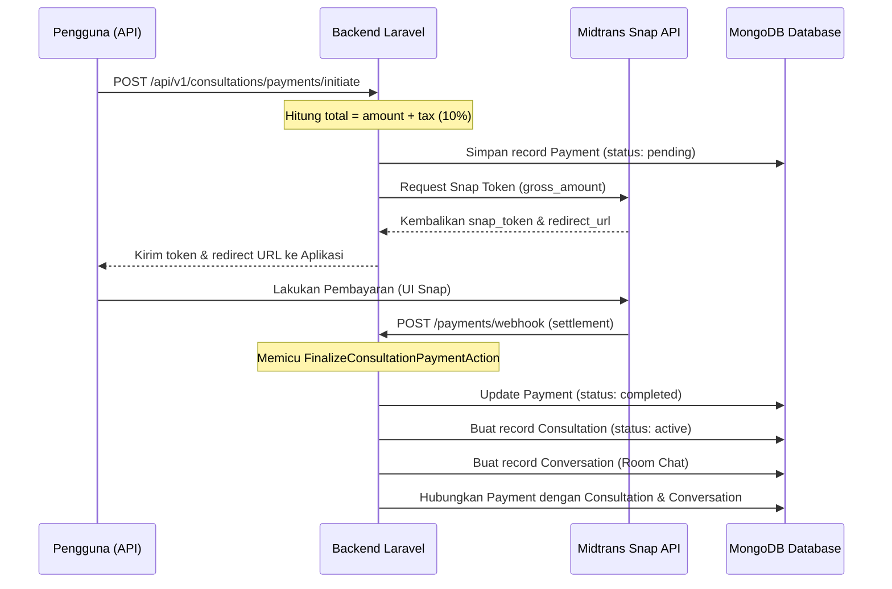
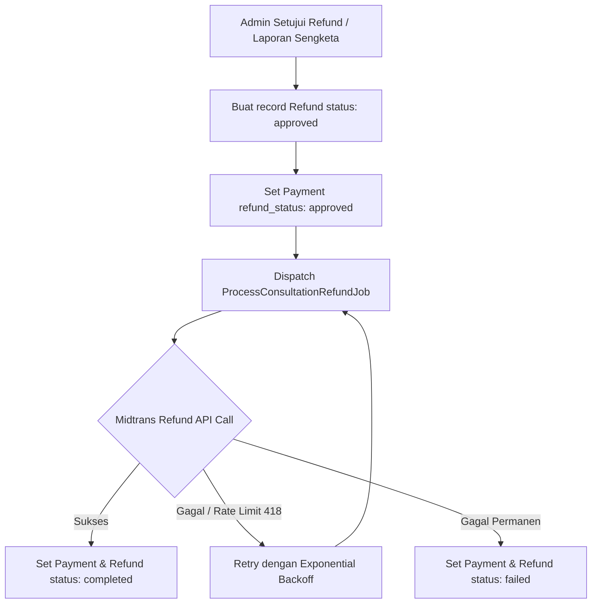

# HaloSitek Backoffice

Backoffice untuk HaloSitek berbasis Laravel 12.

Project ini dipakai untuk:
- REST API (auth, user, catalog, architect, FAQ)
- Admin panel internal via Filament
- Workflow quality check sebelum commit/push

## Stack

- Laravel 12
- MongoDB (`mongodb/laravel-mongodb`)
- Filament v5
- Sanctum
- Pest

## Kebutuhan

- PHP 8.2+
- Composer 2.x
- MongoDB aktif di local
- Node.js + npm

## Quick Start

```bash
composer install
npm install

cp .env.example .env
php artisan key:generate

# set env database
# DB_CONNECTION=mongodb
# DB_DATABASE=halositek_backoffice

php artisan migrate
php artisan db:seed

php artisan filament:assets
php artisan make:filament-user

php artisan serve
```

Admin panel: `http://localhost:8000/admin`

## API Ringkas

Prefix semua endpoint: `/api/v1`

- Public auth: `/auth/register`, `/auth/login`, `/auth/refresh-token`
- Authenticated: `/me`, `/logout`, like/unlike catalog, save/unsave architect
- Admin: manage users, verify architect/catalog, manage FAQ
- Public data: list/detail catalog, architect, FAQ

Referensi route: `routes/api.php`

## Implementasi Fitur Chat

Endpoint chat ada di prefix `/api/v1/chat` (butuh `auth:sanctum`):

- `GET /conversations`: ambil daftar conversation milik user login.
- `POST /conversations`: buat conversation baru (private/group).
- `GET /conversations/{conversationId}`: detail conversation.
- `GET /conversations/{conversationId}/messages`: daftar message per conversation.
- `POST /messages`: kirim message.
- `POST /conversations/{conversationId}/read`: tandai message lawan bicara sebagai sudah dibaca.
- `POST /conversations/{conversationId}/typing`: kirim typing indicator realtime.

### Integrasi AI Service (Local)

Set environment backend Laravel ke AI service:

```bash
HALOSITEK_AI_URL=http://127.0.0.1:8001
```

Alur endpoint:

- `POST /api/v1/chat/messages`: endpoint utama chat. Request teks diproses sinkron, request bergaya gambar akan diproses async (queue).
- `POST /api/v1/chat/ai/messages`: endpoint legacy untuk direct AI chat.

Jalankan worker queue agar balasan AI async (gambar/visualisasi) benar-benar terkirim:

```bash
php artisan queue:work
```

### Alur Implementasi

- `CreateConversationAction`: validasi partisipan, buat private/group chat, dan cegah duplikasi private conversation untuk partisipan yang sama.
- `GetUserConversationsAction`: ambil conversation user berdasarkan `participant_ids`, urut `updated_at DESC`, sertakan `last_message` dan `unread_count`.
- `SendMessageAction`: simpan message, update `last_read_at` pengirim, broadcast event `MessageSent`, lalu kirim notifikasi.
- `MarkMessageAsReadAction`: update `read_at` untuk message lawan bicara dan update `last_read_at` user aktif.

### Model dan Data

- `Conversation` dan `Message` disimpan di MongoDB.
- `participant_ids` dan `last_read_at` pada `Conversation` harus bertipe array/object (bukan JSON string).
- Untuk normalisasi data lama, jalankan:

```bash
php artisan chat:normalize-conversations --dry-run
php artisan chat:normalize-conversations
```

### Realtime dan Notifikasi

- Channel broadcast privat: `chat.conversation.{conversationId}` (lihat `routes/channels.php`).
- Event realtime: `chat.message.sent` dan `chat.typing`.
- `NewMessageNotification` saat ini dikirim via channel `broadcast` agar alur API chat tetap stabil pada setup lokal tanpa dependency notifikasi database.

### Test Chat

Jalankan test fitur chat:

```bash
php artisan test tests/Feature/Api/ChatApiTest.php tests/Feature/Api/ChatConversationFlowApiTest.php
```

## Alur Konsultasi: Payment, Refund, dan Report

Sistem pengelolaan konsultasi di HaloSitek terbagi menjadi tiga alur utama yang saling terintegrasi: **Pembayaran (Payment)**, **Pengembalian Dana (Refund)**, dan **Pelaporan & Pencairan Dana (Report & Payroll/Payout)**.

### 1. Sistem Pembayaran (Payment Flow)

Alur pembayaran memfasilitasi pengguna untuk membeli sesi konsultasi dengan arsitek menggunakan Midtrans Snap.



*   **Inisiasi Pembayaran (`/payments/initiate`):** Pengguna mengirim data arsitek dan durasi. Sistem menghitung pajak pengguna sebesar 10% (`user_tax_amount`), membuat nomor order unik, menyimpan data `Payment` berstatus `pending`, dan melakukan request Snap Transaction ke Midtrans.
*   **Webhook Midtrans (`/payments/webhook`):** Midtrans mengirimkan notifikasi asinkron setelah pembayaran berhasil dilakukan. Ketika status transaksi bernilai `settlement`, status pembayaran diubah menjadi `completed` dan di-finalize.
*   **Finalisasi & Pembukaan Sesi (`FinalizeConsultationPaymentAction`):** 
    1. Status `Payment` diperbarui ke `completed`.
    2. Membuat record `Consultation` baru dengan status `active`, menetapkan durasi (`duration_hours`), dan menetapkan waktu mulai (`consultation_date`).
    3. Membuat record `Conversation` baru (Private Room Chat) yang mendaftarkan user dan arsitek sebagai partisipan.
    4. Menautkan `consultation_id` dan `conversation_id` pada model `Payment`, `Consultation`, dan `Conversation` secara timbal-balik agar chat tervalidasi oleh sesi aktif.
*   **Sinkronisasi Status (`/payments/{paymentId}/status`):** Jika webhook mengalami delay di lokal, endpoint ini mendeteksi status `pending` dan akan melakukan request status langsung ke Midtrans (`fetchTransactionStatus`), lalu memicu finalisasi otomatis jika pembayaran ternyata sudah sukses.

---

### 2. Sistem Pengembalian Dana (Refund Flow - Async & Decoupled)

Untuk stabilitas riwayat audit, status utama pembayaran (`Payment::$status`) tetap bernilai `completed` setelah pembayaran sukses. Seluruh daur hidup refund dipisahkan (**decoupled**) dan ditangani secara asinkron menggunakan queue background job.



*   **Pemisahan Daur Hidup (Decoupled State):**
    *   `Payment::$status` -> Tetap `completed` (menyatakan transaksi sukses awal).
    *   `Payment::$refund_status` -> Melacak siklus refund secara mandiri: `none` -> `pending` -> `processing` -> `completed` / `failed`.
*   **Pemrosesan Asinkron Queue (`ProcessConsultationRefundJob`):**
    *   Ketika refund disetujui (misal dari aksi admin Filament atau API), sistem membuat record `Refund` berstatus `approved` dan mengirim job refund ke queue antrean.
    *   Job ini melakukan request pemotongan dana ke Midtrans API secara direct refund.
    *   Dilengkapi dengan **Exponential Backoff** (`$backoff = [300, 600, 1200, 2400]`) agar ketika server Midtrans mengembalikan status limit (seperti error `418`), antrean akan melakukan penundaan retry secara otomatis (5m, 10m, 20m, 40m) tanpa menyumbat queue lainnya.

---

### 3. Sistem Pelaporan & Payout Arsitek (Report & Payout Flow)

Sistem ini melindungi kepuasan pengguna (User) sekaligus menjamin hak arsitek melalui pelaporan sengketa dan payroll terkelola.

#### Alur Pelaporan Sengketa (Consultation Report)
Jika ada masalah selama konsultasi berjalan (misalnya arsitek tidak hadir atau sebaliknya), pihak yang dirugikan dapat mengajukan laporan melalui model `ConsultationReport`. Laporan ini berisi `requester`, `opposingParty`, `reason` (alasan), dan `proof` (bukti gambar pendukung).

Admin meninjau laporan ini dan mengambil keputusan melalui aksi `/consultations/reports/{reportId}/action`. Berlaku **Rule Buyback (Kebijakan Pengembalian Dana)**:
1.  **Laporan User Disetujui (Approved):** Admin menyetujui bahwa arsitek bermasalah. Sistem menerapkan buyback: dana dikembalikan penuh ke User melalui alur refund asinkron di atas, dan payout arsitek dibatalkan.
2.  **Laporan Arsitek Ditolak (Declined):** Admin menolak klaim arsitek (artinya user benar). Sistem menerapkan buyback: dana dikembalikan penuh ke User dan payout arsitek dibatalkan.
3.  **Laporan Ditolak/Lainnya:** Status pembayaran awal tetap valid, sesi dianggap sukses, dan dana dapat dicairkan ke arsitek.

#### Alur Pencairan Payroll Arsitek (Payroll Release)
Pembayaran honor arsitek dikelola secara terpusat untuk menghindari fraud.

*   **Status Payout Konsultasi (`Consultation::$payout_status`):** Dapat bernilai `pending`, `released`, atau `cancelled`.
*   **Perhitungan Payroll:** Potongan pajak platform/arsitek diatur sebesar 10% (`payout_tax_amount`). Arsitek akan menerima dana bersih sebesar `payout_amount` (90% dari `session_fee`).
*   **Antrean Payroll (`/consultations/payroll/queue`):** Mengelompokkan semua sesi konsultasi yang telah selesai (`status => 'completed'`) dan terverifikasi admin (`verification_status => 'verified'`) dengan status payout `pending`.
*   **Eksekusi Pencairan (`/payroll/queue/{architectId}/release`):** Setelah admin menyetujui pencairan dana untuk arsitek tertentu, sistem akan memperbarui `payout_status` menjadi `released` dan mencatat waktu rilis di `payout_released_at`.

## Quality Check

Perintah utama:

```bash
composer quality
```

Perintah terpisah:

```bash
composer pint:check
composer phpcs
composer phpstan
composer test
```

## Git Hooks

- Pre-commit: lint staged PHP files (Pint + PHPCS)
- Pre-push: jalankan `composer phpstan`

Aktifkan hook jika belum:

```bash
npm run prepare
```

## Catatan Developer

- Jika ada issue lama di static analysis, baseline ada di `phpstan-baseline.neon`.
- Tambahkan kode baru tetap harus clean terhadap Pint, PHPCS, PHPStan, dan test.
